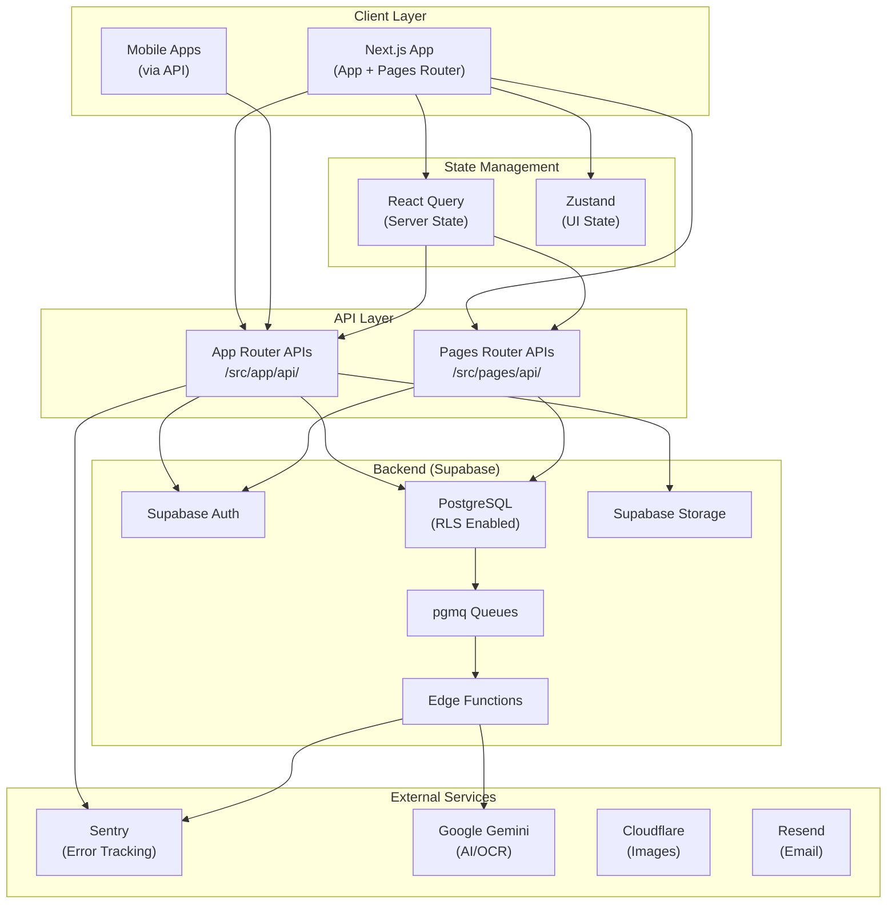
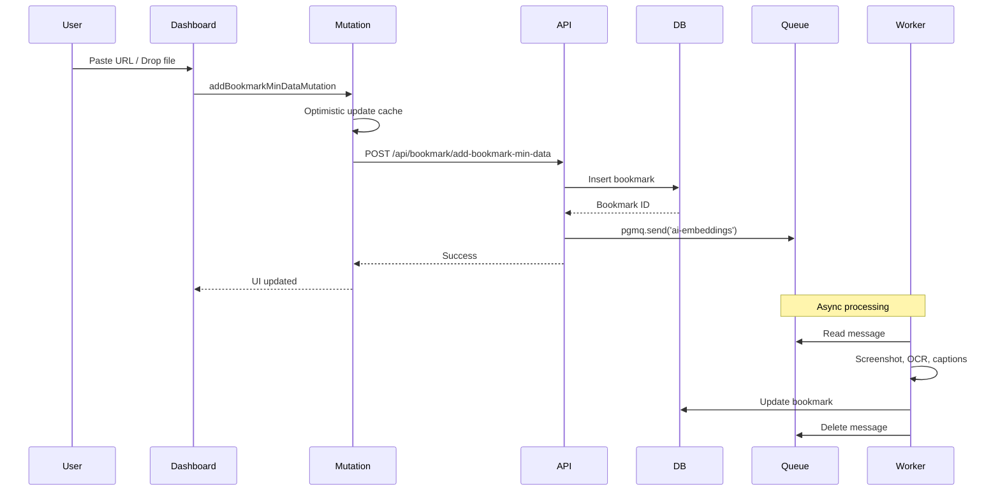
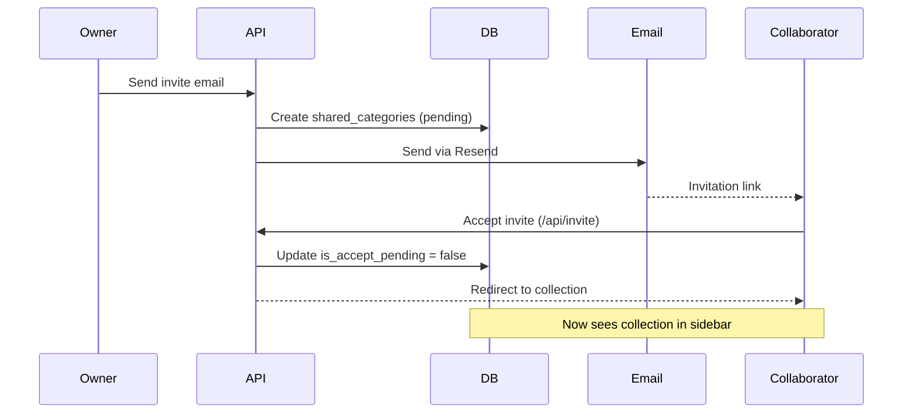

# Codebase Map

> Auto-generated by Cartographer. Last mapped: 2026-01-22

## System Overview

Recollect is a **bookmark management application** built with Next.js, Supabase, and modern React patterns. It supports bookmark organization, collaboration, AI enrichment, and multi-platform imports (Twitter/X, Instagram, Raindrop).



## Directory Structure

```text
recollect/
├── .claude/                    # Claude Code rules & skills
│   ├── rules/                  # Development guidelines (13 files)
│   └── skills/                 # Specialized agent skills
├── .github/                    # CI/CD, templates, workflows
├── docs/                       # Project documentation
├── supabase/                   # Database & edge functions
│   ├── migrations/             # 16 migration files
│   ├── functions/              # Edge function workers
│   └── config.toml             # Local dev config
├── src/
│   ├── app/                    # App Router (auth, new APIs)
│   │   ├── (guest)/            # Auth pages & handlers
│   │   └── api/                # Modern API routes
│   ├── pages/                  # Pages Router (dashboard, legacy APIs)
│   │   └── api/                # Legacy API routes
│   ├── async/                  # Data layer
│   │   ├── mutationHooks/      # Optimistic mutations
│   │   ├── queryHooks/         # React Query fetchers
│   │   └── supabaseCrudHelpers/ # DB operations
│   ├── components/             # Reusable UI components
│   │   ├── ui/recollect/       # Base UI components
│   │   └── providers/          # Context providers
│   ├── pageComponents/         # Page-specific components
│   │   ├── dashboard/          # Main app interface
│   │   └── settings/           # User settings
│   ├── hooks/                  # Custom React hooks
│   ├── lib/                    # Core utilities
│   │   ├── api-helpers/        # API response/handler factories
│   │   └── supabase/           # Client factories
│   ├── store/                  # Zustand stores
│   ├── types/                  # TypeScript definitions
│   ├── utils/                  # Utility functions
│   ├── icons/                  # SVG icon components (60+)
│   └── styles/                 # Global CSS + Tailwind
└── scripts/                    # Build & dev utilities
```

## Module Guide

### Authentication (`src/app/(guest)/`, `src/lib/supabase/`)

**Purpose**: User authentication via Supabase Auth (Google OAuth, Magic Link)

**Entry Points**:

- `/login` → `src/app/(guest)/(auth)/login/page.tsx`
- `/auth/confirm` → `src/app/(guest)/auth/confirm/route.ts`
- `/auth/oauth` → `src/app/(guest)/auth/oauth/route.ts`

**Key Files**:

| File                         | Purpose                        |
| ---------------------------- | ------------------------------ |
| `lib/supabase/client.ts`     | Browser client factory         |
| `lib/supabase/server.ts`     | Server client with cookies     |
| `lib/supabase/middleware.ts` | Session refresh + route guards |
| `lib/supabase/api.ts`        | `requireAuth()` for API routes |

**Pattern**: SSR-safe Supabase with `getAll`/`setAll` cookies (never individual methods)

---

### API Layer (`src/app/api/`, `src/pages/api/`)

**Purpose**: Backend-for-frontend REST APIs

**Architecture**:

- **App Router** (modern): Handler factories with auto validation
- **Pages Router** (legacy): Manual auth checks, migrating to App Router

**Key Exports**:

| Factory                        | Auth     | Use                  |
| ------------------------------ | -------- | -------------------- |
| `createGetApiHandler`          | Public   | Public reads         |
| `createPostApiHandler`         | Public   | Public writes        |
| `createGetApiHandlerWithAuth`  | Required | Authenticated reads  |
| `createPostApiHandlerWithAuth` | Required | Authenticated writes |

**Response Helpers** (`lib/api-helpers/response.ts`):

- `apiSuccess()` - Zod-validated success (200)
- `apiError()` - System errors + Sentry (500)
- `apiWarn()` - User errors, no Sentry (4xx)
- `parseBody()` - Request validation

**API Organization**:

```text
/api/bookmark/     → CRUD, search, trash
/api/category/     → Create, assign, update
/api/tags/         → Create, assign, remove
/api/instagram/    → Sync queue, status, retry
/api/share/        → Collaboration emails
/api/v1/           → Versioned/external APIs
```

---

### Data Layer (`src/async/`)

**Purpose**: React Query hooks with optimistic updates

**Structure**:

```text
async/
├── mutationHooks/       # Optimistic mutations by entity
│   ├── bookmarks/       # Add, delete, trash, screenshot
│   ├── category/        # Add, remove, set categories
│   ├── tags/            # Add, remove, create-and-assign
│   └── ...
├── queryHooks/          # Data fetching
│   ├── bookmarks/       # Paginated, search, discover
│   ├── category/        # User categories, shared
│   └── ...
└── supabaseCrudHelpers/ # Raw DB operations (index.ts)
```

**Mutation Pattern**:

```typescript
useReactQueryOptimisticMutation({
  mutationFn: apiCall,
  queryKey: [BOOKMARKS_KEY, userId, categoryId],
  secondaryQueryKey: searchQueryKey,  // Search cache
  updater: (cache, vars) => updateBookmarkInPaginatedData(cache, vars.id, ...)
  additionalOptimisticUpdates: [...]  // Single bookmark cache
});
```

**Features**:

- Immer-based cache mutations
- Multi-cache updates (primary, search, single item)
- Temp ID swapping for create-and-assign
- Sentry breadcrumbs for cache misses
- Automatic rollback on error

---

### State Management (`src/store/`, React Query)

**Zustand Stores** (UI state):

| Store                   | Purpose                      | Persisted |
| ----------------------- | ---------------------------- | --------- |
| `useSidePaneStore`      | Side panel visibility        | Yes       |
| `useIframeStore`        | Iframe embed toggle          | Yes       |
| `useLoadersStore`       | Loading states per bookmark  | No        |
| `useMiscellaneousStore` | Lightbox, search, drag state | No        |
| `useSupabaseSession`    | Session cache                | No        |

**React Query** (server state):

- Query keys: `[RESOURCE_KEY, userId, ...filters]`
- Stale time: 5 minutes
- Window focus refetch enabled
- Infinite queries for pagination

---

### Dashboard UI (`src/pageComponents/dashboard/`)

**Purpose**: Main application interface

**Architecture**:

```text
dashboard/
├── index.tsx              # Root orchestrator
├── cardSection/           # Bookmark cards (4 view modes)
│   ├── index.tsx          # View mode switching
│   ├── listBox.tsx        # React-aria draggable list
│   ├── edit-popover.tsx   # Multi-select tags/categories
│   └── imageCard.tsx      # Image with blurhash
├── dashboardLayout/       # Layout + navigation
│   ├── index.tsx          # Split-pane (Allotment)
│   └── searchComponents.tsx
├── sidePane/              # Sidebar
│   ├── collectionsList.tsx # Drag-drop reorderable
│   └── sidePaneTypesList.tsx
└── share/                 # Collaboration UI
```

**View Modes**: Card, List, Moodboard, Timeline

**Key Patterns**:

- Infinite scroll with React Query
- Optimistic updates for all mutations
- Drag-drop: Collections reorder + bookmark assignment
- Permission-based UI (owner vs collaborator vs viewer)
- Responsive: Split-pane (desktop) / Drawer (mobile)

---

### Components (`src/components/`)

**Base UI Components** (`ui/recollect/`):

| Component         | Pattern  | Purpose                               |
| ----------------- | -------- | ------------------------------------- |
| `combobox/`       | Compound | Multi-select with filtering, creation |
| `scroll-area.tsx` | Wrapper  | Scrollable with fade masks            |
| `button.tsx`      | Wrapper  | Pending state support                 |
| `spinner.tsx`     | Atomic   | Loading indicator                     |

**Compound Component Pattern** (Combobox):

```typescript
<Combobox.Root>
  <Combobox.Chips>
    <Combobox.Input />
  </Combobox.Chips>
  <Combobox.Portal>
    <Combobox.List>
      <Combobox.Item />
    </Combobox.List>
  </Combobox.Portal>
</Combobox.Root>
```

**Legacy Components**: React Aria (lightbox, some dropdowns), Ariakit (specialized)

---

### Custom Hooks (`src/hooks/`)

**React Query Wrappers**:

| Hook                              | Purpose                                 |
| --------------------------------- | --------------------------------------- |
| `useReactQuery`                   | Enhanced with callbacks, toast handling |
| `useReactQueryMutation`           | Retry config, UI feedback               |
| `useReactQueryOptimisticMutation` | Snapshot + rollback                     |

**Cache Helpers**:

| Hook                         | Purpose                                     |
| ---------------------------- | ------------------------------------------- |
| `useBookmarkMutationContext` | Shared mutation context                     |
| `useBookmarkRelation`        | Cache subscription via useSyncExternalStore |
| `useBookmarkCategories`      | Get bookmark's category IDs from cache      |
| `useCategoryMultiSelect`     | Complete multi-select logic                 |

**Utilities**:

- `createSafeContext()` - Type-safe context factory
- `usePendingWithMinDuration()` - Prevent loading flashes

---

### Database (`supabase/`)

**PostgreSQL 17** with extensions:

- `vector` - AI embeddings (768 dimensions)
- `pgmq` - Message queues (Instagram imports, AI enrichment)
- `pg_trgm` - Fuzzy text search
- `pg_cron` - Scheduled jobs
- `citext` - Case-insensitive text

**Core Tables**:

| Table                 | Purpose                          |
| --------------------- | -------------------------------- |
| `profiles`            | User data, preferences, API keys |
| `everything`          | Main bookmarks table             |
| `categories`          | Bookmark collections             |
| `bookmark_categories` | Many-to-many junction            |
| `tags`                | User tags                        |
| `bookmark_tags`       | Many-to-many junction            |
| `shared_categories`   | Collaboration                    |

**RLS Pattern**:

- SELECT: Own + shared + public
- INSERT/UPDATE/DELETE: Own only
- Performance: `(select auth.uid())` wrapper

**Migrations**: 16 files, naming `YYYYMMDDHHmmss_description.sql`

---

### Edge Functions (`supabase/functions/`)

**`process-instagram-imports`**:

- Reads from pgmq queue (batch of 5)
- Validates Instagram URLs
- Calls `process_instagram_bookmark` RPC
- Max 3 retries, archives failures
- Sentry integration

**Queue Flow**:

```text
API → pgmq.send() → Queue → Edge Function → RPC → Bookmark Created
```

---

### Styling (`src/styles/`)

**Tailwind CSS v4** with comprehensive design tokens:

- 150+ color tokens (light/dark modes)
- 8 custom shadows
- Inter Variable font
- Progressive enhancement (scroll-driven animations)

**Component Overrides**: Allotment, React Masonry, Toastify, Lightbox

---

## Data Flow

### Bookmark Creation



### Collaboration Flow



## Conventions

### Naming

- **Components**: PascalCase (`HeaderNavigation.tsx`)
- **Hooks**: camelCase with `use` prefix (`useBookmarkMutation.ts`)
- **Files**: kebab-case (`api-helpers.ts`)
- **Tables**: snake_case, plural (`bookmark_categories`)

### Code Style

- Max 250 lines per file
- Named exports (default only for Next.js pages)
- Props object pattern for 2+ parameters
- `cn()` utility for conditional Tailwind classes

### API Response Format

```typescript
// Success
{ data: T, error: null }

// Error
{ data: null, error: "User-friendly message" }
```

### Mutation Naming

```text
use{Action}{Entity}OptimisticMutation
// useAddCategoryToBookmarkOptimisticMutation
```

## Gotchas

### Supabase SSR

- **NEVER** use individual cookie methods (`get`, `set`, `remove`)
- **ALWAYS** use `getAll`/`setAll` pattern
- Service role key bypasses RLS - server-only

### Supabase CLI

- **NEVER** run `supabase link`, `db push`, `db pull` (affects production)
- **ALWAYS** use `npx supabase ...` for version consistency
- Default to `migration up` over `db reset`

### React Query

- Search queries use separate cache key
- Mutations update both primary and search caches
- Cache misses logged to Sentry as breadcrumbs

### Next.js

- `ignoreBuildErrors: true` - TypeScript errors don't block builds
- Remote images allow ALL HTTPS hosts
- `/` redirects to `/everything`

### Environment

- Dev server already running - don't restart
- `pnpm db:types` after schema changes
- `SKIP_ENV_VALIDATION` to bypass env checks

## Navigation Guide

**To add a new API endpoint**:

1. Create route file in `src/app/api/{resource}/route.ts`
2. Use `createPostApiHandlerWithAuth` factory
3. Define Zod schemas for input/output
4. Add types to `src/types/apiTypes.ts`

**To add a new mutation hook**:

1. Create hook in `src/async/mutationHooks/{entity}/`
2. Use `useReactQueryOptimisticMutation`
3. Implement `updater` with `updateBookmarkInPaginatedData`
4. Add secondary/additional cache updates as needed

**To add a new component**:

1. Create in `src/components/ui/recollect/` for reusable
2. Use Base UI primitives
3. Follow compound component pattern for complex UI
4. Export from index file

**To add a new migration**:

1. Create `supabase/migrations/YYYYMMDDHHmmss_description.sql`
2. Include header comment with purpose
3. Enable RLS on new tables
4. Create separate policies per operation/role
5. Run `npx supabase migration up`
6. Run `pnpm db:types`

**To modify auth flow**:

- OAuth: `src/app/(guest)/auth/oauth/route.ts`
- Magic link: `src/app/(guest)/auth/confirm/route.ts`
- Middleware: `src/lib/supabase/middleware.ts`

**To add Instagram/Twitter import**:

1. Queue via pgmq in API
2. Edge function processes queue
3. RPC handles atomic insert + queue deletion
