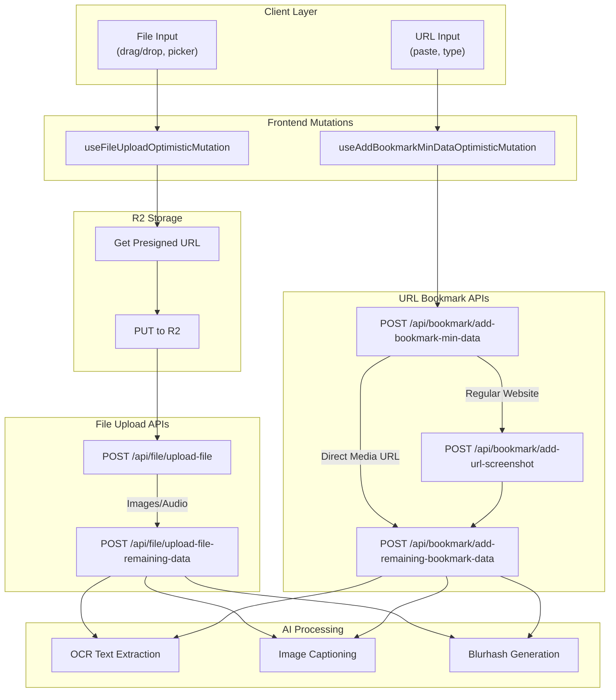

# Upload Flow Documentation

> Detailed documentation of file and URL upload flows for Images, Videos, Audio, Documents, and Links.

## Quick Reference

| Content Type             | Primary API                                | Secondary API                                           | Secondary Called By   |
| ------------------------ | ------------------------------------------ | ------------------------------------------------------- | --------------------- |
| **Images**               | `POST /api/file/upload-file`               | `POST /api/file/upload-file-remaining-data`             | Backend (internal)    |
| **Videos**               | `POST /api/file/upload-file`               | _(none - stops after upload)_                           | -                     |
| **Audio**                | `POST /api/file/upload-file`               | `POST /api/file/upload-file-remaining-data`             | Backend (internal)    |
| **PDFs**                 | `POST /api/file/upload-file`               | _(client-side PDF thumbnail handler)_                   | Frontend              |
| **Links (website)**      | `POST /api/bookmark/add-bookmark-min-data` | `add-url-screenshot` then `add-remaining-bookmark-data` | Frontend then Backend |
| **Links (direct media)** | `POST /api/bookmark/add-bookmark-min-data` | `POST /api/bookmark/add-remaining-bookmark-data`        | Backend (internal)    |

---

## System Overview



---

## File Upload Flow (Images, Videos, Audio, Documents)

### File Upload Architecture

```text
User selects file from computer
        │
        ▼
┌───────────────────────────────────────────────────────────┐
│  useFileUploadOptimisticMutation.ts                       │
│  src/async/mutationHooks/files/                           │
│  ─────────────────────────────────────────────────────────│
│  • Detect file MIME type                                  │
│  • (Video) Generate thumbnail from first frame            │
│  • Request presigned URL from R2                          │
│  • Upload file directly to R2 (PUT request)               │
│  • (Video) Upload thumbnail to R2                         │
│  • Optimistic cache update                                │
└───────────────────────────────────────────────────────────┘
        │
        ▼
┌───────────────────────────────────────────────────────────┐
│  POST /api/file/upload-file                               │
│  src/pages/api/file/upload-file.ts                        │
│  ─────────────────────────────────────────────────────────│
│  Request Body:                                            │
│  {                                                        │
│    category_id: string,                                   │
│    name: string,           // filename                    │
│    type: string,           // MIME type                   │
│    uploadFileNamePath: string,                            │
│    thumbnailPath?: string  // Video only                  │
│  }                                                        │
│  ─────────────────────────────────────────────────────────│
│  Actions:                                                 │
│  • Verify user auth & category ownership                  │
│  • Get public URL from R2                                 │
│  • Detect media type via getMediaType()                   │
│  • (Video) Process thumbnail: blurhash, OCR               │
│  • Insert bookmark record to database                     │
│  • Associate with category (junction table)               │
└───────────────────────────────────────────────────────────┘
        │
        ├─────────────────────────────────────┐
        │                                     │
        ▼                                     ▼
┌─────────────────┐               ┌───────────────────────┐
│  VIDEO / PDF    │               │  IMAGE / AUDIO        │
│  ───────────────│               │  ─────────────────────│
│  STOPS HERE     │               │  Continue below...    │
│                 │               └───────────────────────┘
│  • Video has    │                           │
│    thumbnail    │                           │
│  • PDF handled  │                           ▼
│    client-side  │   ┌─────────────────────────────────────────────────┐
└─────────────────┘   │  POST /api/file/upload-file-remaining-data      │
                      │  src/pages/api/file/upload-file-remaining-data.ts│
                      │  ───────────────────────────────────────────────│
                      │  Request Body:                                  │
                      │  {                                              │
                      │    id: number,        // bookmark ID            │
                      │    publicUrl: string, // R2 file URL            │
                      │    mediaType: string  // MIME type              │
                      │  }                                              │
                      │  ───────────────────────────────────────────────│
                      │  Actions:                                       │
                      │  • AI image captioning (Gemini)                 │
                      │  • OCR text extraction                          │
                      │  • Blurhash generation                          │
                      │  • Keyword extraction                           │
                      │  • Auto-assign collections                      │
                      │  • Update DB with enriched metadata             │
                      └─────────────────────────────────────────────────┘
```

### Request/Response Shapes

**upload-file Request:**

```typescript
interface UploadFilePayload {
  category_id: string;
  name: string;
  type: string; // MIME type: "image/png", "video/mp4", etc.
  uploadFileNamePath: string; // R2 path where file was uploaded
  thumbnailPath?: string; // R2 path for video thumbnail (video only)
}
```

**upload-file-remaining-data Request:**

```typescript
interface UploadFileRemainingPayload {
  id: number; // Bookmark ID from upload-file response
  publicUrl: string; // Public R2 URL
  mediaType: string; // MIME type
}
```

### Media Type Decision Matrix

| MIME Type            | Calls remaining-data? | Reason                             |
| -------------------- | --------------------- | ---------------------------------- |
| `image/*`            | Yes                   | Needs AI caption, OCR, blurhash    |
| `video/*`            | No                    | Thumbnail processed in upload-file |
| `audio/*`            | Yes                   | Metadata enrichment                |
| `application/pdf`    | No                    | PDF thumbnail handled client-side  |
| `application/msword` | Yes                   | Document metadata                  |

---

## URL Bookmark Flow (Links)

### URL Bookmark Architecture

```text
User enters URL
        │
        ▼
┌───────────────────────────────────────────────────────────┐
│  useAddBookmarkMinDataOptimisticMutation.ts               │
│  src/async/mutationHooks/bookmarks/                       │
│  ─────────────────────────────────────────────────────────│
│  • Optimistic cache update                                │
│  • Call add-bookmark-min-data API                         │
│  • onSettled: decide next step based on media type        │
└───────────────────────────────────────────────────────────┘
        │
        ▼
┌───────────────────────────────────────────────────────────┐
│  POST /api/bookmark/add-bookmark-min-data                 │
│  src/pages/api/bookmark/add-bookmark-min-data.ts          │
│  ─────────────────────────────────────────────────────────│
│  Request Body:                                            │
│  {                                                        │
│    url: string,                                           │
│    category_id?: number,                                  │
│    update_access: boolean                                 │
│  }                                                        │
│  ─────────────────────────────────────────────────────────│
│  Actions:                                                 │
│  • Scrape URL (OpenGraph: title, description, ogImage)    │
│  • checkIfUrlAnMedia() - is it a direct media file?       │
│  • Test iframe embed capability                           │
│  • Insert bookmark record                                 │
│  • Associate with category                                │
└───────────────────────────────────────────────────────────┘
        │
        ├─────────────────────────────────────────────────────┐
        │                                                     │
        ▼                                                     ▼
┌───────────────────────────┐             ┌───────────────────────────────┐
│  DIRECT MEDIA URL         │             │  REGULAR WEBSITE              │
│  (image.png, video.mp4)   │             │  (google.com, etc.)           │
│  ─────────────────────────│             │  ─────────────────────────────│
│  Backend calls:           │             │  Frontend onSettled calls:    │
│  add-remaining-bookmark-  │             │  add-url-screenshot API       │
│  data immediately         │             └───────────────────────────────┘
└───────────────────────────┘                             │
        │                                                 │
        │                                                 ▼
        │                     ┌───────────────────────────────────────────┐
        │                     │  POST /api/bookmark/add-url-screenshot    │
        │                     │  src/pages/api/bookmark/add-url-screenshot│
        │                     │  ─────────────────────────────────────────│
        │                     │  Request: { url, id }                     │
        │                     │  Actions:                                 │
        │                     │  • Call external screenshot service       │
        │                     │  • Upload screenshot to R2                │
        │                     │  • Always calls add-remaining-bookmark    │
        │                     │    (success or failure)                   │
        │                     └───────────────────────────────────────────┘
        │                                                 │
        ▼                                                 ▼
┌─────────────────────────────────────────────────────────────────────────┐
│  POST /api/bookmark/add-remaining-bookmark-data                         │
│  src/pages/api/bookmark/add-remaining-bookmark-data.ts                  │
│  ───────────────────────────────────────────────────────────────────────│
│  Request Body:                                                          │
│  {                                                                      │
│    url: string,                                                         │
│    id: number,                                                          │
│    favIcon?: string                                                     │
│  }                                                                      │
│  ───────────────────────────────────────────────────────────────────────│
│  Actions:                                                               │
│  • (Image URL) Download & upload to R2                                  │
│  • (Website) Upload scraped ogImage to R2                               │
│  • AI image captioning                                                  │
│  • OCR text extraction                                                  │
│  • Blurhash generation                                                  │
│  • Auto-assign collections via keywords                                 │
│  • Update DB with enriched metadata                                     │
└─────────────────────────────────────────────────────────────────────────┘
```

### URL Bookmark Request/Response Shapes

**add-bookmark-min-data Request:**

```typescript
interface AddBookmarkMinDataPayload {
  url: string;
  category_id?: number | "null" | string;
  update_access: boolean;
}
```

**add-url-screenshot Request:**

```typescript
interface AddBookmarkScreenshotPayload {
  url: string;
  id: number; // Bookmark ID from add-bookmark-min-data
}
```

**add-remaining-bookmark-data Request:**

```typescript
interface AddBookmarkRemainingPayload {
  url: string;
  id: number;
  favIcon?: string;
}
```

### URL Type Decision Matrix

| URL Type        | Example             | Screenshot API? | Remaining API?            |
| --------------- | ------------------- | --------------- | ------------------------- |
| Direct image    | `cdn.com/photo.png` | No              | Yes (backend)             |
| Direct video    | `cdn.com/video.mp4` | No              | Yes (backend)             |
| Direct audio    | `cdn.com/song.mp3`  | No              | No (has fallback)         |
| Direct PDF      | `cdn.com/doc.pdf`   | No              | Yes (backend)             |
| Regular website | `google.com`        | Yes             | Yes (from screenshot API) |

---

## Mobile/External Client Guide

### For Local File Upload (Images, Videos, Audio, Documents)

#### Step 1: Upload file to R2

```bash
# Get presigned URL (implementation specific to your R2 setup)
# PUT file to presigned URL
```

#### Step 2: Call upload-file API

```bash
POST /api/file/upload-file
Content-Type: application/json
Authorization: Bearer <token>

{
  "category_id": "123",
  "name": "photo.jpg",
  "type": "image/jpeg",
  "uploadFileNamePath": "user-id/filename-uuid.jpg"
}
```

#### Step 3: For Images/Audio only - call remaining-data API

```bash
POST /api/file/upload-file-remaining-data
Content-Type: application/json
Authorization: Bearer <token>

{
  "id": 456,
  "publicUrl": "https://r2.example.com/user-id/filename-uuid.jpg",
  "mediaType": "image/jpeg"
}
```

### For URL Bookmarks (Links)

**Single API call (enrichment happens server-side for direct media):**

```bash
POST /api/bookmark/add-bookmark-min-data
Content-Type: application/json
Authorization: Bearer <token>

{
  "url": "https://example.com/article",
  "category_id": 123,
  "update_access": true
}
```

**For regular websites, optionally call screenshot API:**

```bash
POST /api/bookmark/add-url-screenshot
Content-Type: application/json
Authorization: Bearer <token>

{
  "url": "https://example.com/article",
  "id": 456
}
```

---

## Helper Functions

| Function                        | File                                     | Purpose                                           |
| ------------------------------- | ---------------------------------------- | ------------------------------------------------- |
| `checkIfUrlAnImage(url)`        | `src/utils/helpers.ts`                   | Returns true if MIME type includes "image/"       |
| `checkIfUrlAnMedia(url)`        | `src/utils/helpers.ts`                   | Returns true if MIME type is in acceptedFileTypes |
| `getMediaType(url)`             | `src/async/supabaseCrudHelpers/index.ts` | Fetches MIME type from URL                        |
| `generateVideoThumbnail()`      | `src/utils/helpers.ts`                   | Creates thumbnail from video first frame          |
| `handlePdfThumbnailAndUpload()` | `src/utils/helpers.ts`                   | Generates PDF first page as thumbnail             |
| `acceptedFileTypes`             | `src/utils/constants.ts`                 | Array of supported MIME types                     |

### Accepted File Types

```typescript
// From src/utils/constants.ts
const acceptedFileTypes = [
  // Images (13 types)
  "image/gif",
  "image/jpeg",
  "image/png",
  "image/webp",
  "image/svg+xml",
  "image/tiff",
  "image/bmp",
  "image/avif",
  "image/apng",
  "image/vnd.microsoft.icon",
  "image/x-icon",
  "image/ico",
  "image/jpg",

  // Audio (10 types)
  "audio/mpeg",
  "audio/mp3",
  "audio/wav",
  "audio/ogg",
  "audio/webm",
  "audio/aac",
  "audio/midi",
  "audio/x-midi",
  "audio/3gpp",
  "audio/3gpp2",

  // Video (8 types)
  "video/mp4",
  "video/webm",
  "video/mpeg",
  "video/ogg",
  "video/mp2t",
  "video/3gpp",
  "video/3gpp2",
  "video/x-msvideo",

  // Documents (2 types)
  "application/pdf",
  "application/msword",
];
```

---

## Gotchas

### Video Upload

- **Thumbnail generated client-side**: Videos require extracting the first frame as a thumbnail before calling upload-file
- **No remaining-data API**: Videos skip the enrichment API because the thumbnail is processed in upload-file

### PDF Upload

- **Client-side thumbnail**: PDFs use `handlePdfThumbnailAndUpload()` which is called from the frontend mutation's `onSettled`
- **Skip remaining API**: The upload-file API sets `skipRemainingApi: true` for PDFs

### Audio URLs

- **Fallback image**: Audio files use `AUDIO_OG_IMAGE_FALLBACK_URL` as their ogImage
- **No enrichment needed**: Audio bookmarks skip the remaining-data API since they already have a fallback image

### checkIfUrlAnImage vs checkIfUrlAnMedia

- **`checkIfUrlAnImage(url)`**: Only returns true for `image/*` MIME types
- **`checkIfUrlAnMedia(url)`**: Returns true for any MIME type in `acceptedFileTypes` (images, videos, audio, PDFs)
- **Critical distinction**: The screenshot API cannot capture direct media URLs (videos, PDFs), so the decision logic uses `checkIfUrlAnImage` to determine if screenshot is possible

### Backend vs Frontend API Calls

- **Direct media URLs**: The `add-remaining-bookmark-data` API is called **by the backend** from within `add-bookmark-min-data`
- **Regular websites**: The `add-url-screenshot` API is called **by the frontend** in the mutation's `onSettled` callback
- **Screenshot API always calls remaining**: Whether screenshot succeeds or fails, it always calls `add-remaining-bookmark-data` internally
