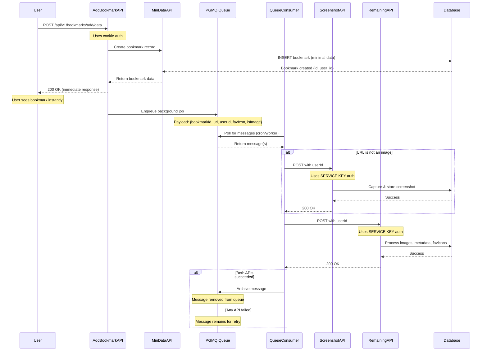

# Bookmark Queue Implementation

## Overview

The bookmark queue system is a **background job processing architecture** that handles time-intensive operations (screenshot capture, image processing, metadata enrichment) asynchronously after a bookmark is created. This ensures fast response times for users while processing heavy workloads in the background.

## Table of Contents

- [Architecture Overview](#architecture-overview)
- [Flow Diagram](#flow-diagram)
- [Components](#components)
- [Why Service Key Authentication?](#why-service-key-authentication)
- [Detailed Flow](#detailed-flow)
- [Key Design Decisions](#key-design-decisions)
- [Message Payload Structure](#message-payload-structure)
- [Error Handling](#error-handling)

---

## Architecture Overview

```text
┌─────────────┐
│   Client    │
│  (Browser)  │
└──────┬──────┘
       │
       │ POST /api/v1/bookmarks/add/data
       │
       ▼
┌─────────────────────────────────────────┐
│  1. Add Bookmark API (data.tsx)         │
│  - Creates bookmark (min-data)          │
│  - Sends immediate response to client   │
│  - Enqueues background job              │
└──────┬──────────────────────────────────┘
       │
       │ Queue Message (PGMQ)
       │
       ▼
┌─────────────────────────────────────────┐
│  2. Queue (PostgreSQL PGMQ)             │
│  - Stores job payload                   │
│  - Handles retries                      │
│  - Ensures job persistence              │
└──────┬──────────────────────────────────┘
       │
       │ Processed by cron job/worker, in our case a worker that fires the consumer api when ever the queue DB is updated and a CRON that deletes all the archive message which is run once everyday
       │
       ▼
┌─────────────────────────────────────────┐
│  3. Queue Consumer (queue-consumer.ts)  │
│  - Reads messages from queue            │
│  - Calls screenshot API                 │
│  - Calls remaining data API             │
│  - Archives successful jobs             |
|  - If failed then it stays in the queue │
└──────┬──────────────────────────────────┘
       │
       ├─────────────────┬─────────────────┐
       │                 │                 │
       ▼                 ▼                 ▼
┌─────────────┐   ┌─────────────┐   ┌─────────────┐
│ Screenshot  │   │  Remaining  │   │   Archive   │
│  API        │   │  Data API   │   │   Message   │
│ (service    │   │ (service    │   │  (success)  │
│  key auth)  │   │  key auth)  │   │             │
└─────────────┘   └─────────────┘   └─────────────┘
```

---

## Flow Diagram

### Complete Bookmark Creation Flow



---

## Components

### 1. Add Bookmark API (`/api/v1/bookmarks/add/data`)

**Purpose:** Main entry point for creating bookmarks

**Authentication:** Cookie-based (user session)

**Responsibilities:**

- Validates request body
- Calls min-data API to create bookmark record
- Returns **immediate response** to user (< 2 seconds)
- Enqueues background job for heavy processing

**Why immediate response?**

- Screenshot capture can take 5-30 seconds
- Image processing can take 10-60 seconds
- Users shouldn't wait for these operations

### 2. PGMQ Queue

**Technology:** PostgreSQL Message Queue (PGMQ)

**Purpose:** Reliable message queue for background jobs

**Features:**

- ✅ Persistence (survives server restarts)
- ✅ Automatic retries (failed jobs remain in queue)
- ✅ Message archiving (successful jobs are archived)
- ✅ Transaction support

**Message Structure:**

```typescript
{
	bookmarkId: number; // Bookmark to process
	url: string; // URL to capture/process
	userId: string; // User who created bookmark
	favIcon: string | null; // Favicon URL (if available)
	isImage: boolean; // Whether URL is an image
}
```

### 3. Queue Consumer API (`/api/v1/bookmarks/add/tasks/queue-consumer`)

**Purpose:** Processes messages from the queue

**Trigger:** Called by cron job or worker process

**Authentication:** Cookie-based (for queue operations only)

**Flow:**

1. Reads up to 10 messages from queue
2. For each message:
   - Validates payload structure
   - Calls Screenshot API (if not an image)
   - Calls Remaining Data API
   - Archives message if both succeed
   - Leaves message in queue if either fails (for retry)

**Batch Processing:**

- Processes 10 messages per run
- Each message is independent
- Failures don't affect other messages

### 4. Screenshot API (`/api/v1/bookmarks/add/tasks/screenshot`)

**Purpose:** Captures screenshot of bookmarked URL

**Authentication:** 🔑 **Service Key** (not cookies)

**Why Service Key?** See [Why Service Key Authentication?](#why-service-key-authentication)

**Process:**

1. Receives `bookmarkId`, `url`, and `userId`
2. Checks if URL is a PDF (uses external service)
3. For non-PDFs: Captures screenshot using Puppeteer/similar
4. Uploads screenshot to R2 storage
5. Extracts page metadata (title, description)
6. Updates bookmark record with screenshot URL and metadata

**Input:**

```typescript
{
	id: number; // Bookmark ID
	url: string; // URL to screenshot
	userId: string; // User ID (for RLS bypass)
}
```

### 5. Remaining Data API (`/api/v1/bookmarks/add/tasks/remaining`)

**Purpose:** Processes images and generates rich metadata

**Authentication:** 🔑 **Service Key** (not cookies)

**Process:**

1. Fetches current bookmark data
2. Processes OG image (if present):
   - Uploads to R2 storage
   - Generates blurhash
   - Extracts image dimensions
   - Performs OCR (text extraction)
   - Generates AI image caption
3. Fetches and stores favicon
4. Updates bookmark with enriched metadata

**Input:**

```typescript
{
	id: number; // Bookmark ID
	url: string; // Bookmark URL
	favIcon: string | null; // Favicon URL
	userId: string; // User ID (for RLS bypass)
}
```

---

## Why Service Key Authentication?

### The Problem

**Background jobs can run hours or days after bookmark creation.**

When a bookmark is created:

1. User's auth cookies are stored in queue message
2. Message sits in queue (could be minutes to days)
3. **Cookies expire** (typical expiry: 1 hour - 7 days)
4. Queue consumer tries to process with expired cookies
5. ❌ **Error:** "Invalid Refresh Token: Refresh Token Not Found"

### The Solution: Service Key Authentication

Instead of using user cookies, we use **Supabase Service Role Key**:

```typescript
// ❌ Cookie-based (FAILS with expired cookies)
const supabase = apiSupabaseClient(request, response);
const userId = await supabase.auth.getUser(); // Returns null with expired cookies

// ✅ Service key-based (WORKS regardless of cookie state)
const supabase = apiSupabaseServiceClient();
const userId = request.body.userId; // Passed explicitly
```

### How Service Key Works

```typescript
// Service key client configuration
export const apiSupabaseServiceClient = () => {
	const supabase = createClient(supabaseUrl, supabaseServiceKey, {
		auth: {
			autoRefreshToken: false, // No token refresh needed
			persistSession: false, // No session persistence
		},
	});
	return supabase;
};
```

**Key Points:**

- Service key has **admin-level access**
- Bypasses Row Level Security (RLS) policies
- Never expires
- Used **only in secure server-side contexts**
- We pass `userId` explicitly to identify which user's data to update

### Security Considerations

✅ **Safe because:**

- Service key is only used on the server
- Never exposed to client
- `userId` is validated (comes from trusted queue message)
- Background jobs run in isolated server environment

❌ **Never do:**

- Expose service key to client
- Use service key in browser code
- Skip userId validation

---

## Detailed Flow

### Step-by-Step Process

#### **Step 1: User Creates Bookmark**

```typescript
// User clicks "Add Bookmark"
POST /api/v1/bookmarks/add/data
{
  url: "https://example.com",
  category_id: 123,
  update_access: true
}
```

**What happens:**

1. Request authenticated via user cookies
2. Validates request body
3. Calls min-data API to create bookmark
4. Returns bookmark data to user **immediately**
5. User sees bookmark in their dashboard instantly! ✨

#### **Step 2: Queue Background Job**

```typescript
// After sending response, enqueue job
const queuePayload = {
	bookmarkId: 456,
	url: "https://example.com",
	userId: "d6f10806-1c03-4884-badb-9a22b33f437b",
	favIcon: "https://example.com/favicon.ico",
	isImage: false,
};

await supabase.schema("pgmq_public").rpc("send", {
	queue_name: "add-bookmark-url-queue",
	message: queuePayload,
});
```

**Message is now in queue, waiting to be processed!**

#### **Step 3: Queue Consumer Processes Job**

```javascript
// Cron job calls queue consumer API every N minutes
GET / api / v1 / bookmarks / add / tasks / queue - consumer;

// Consumer reads messages
const messages = await supabase.schema("pgmq_public").rpc("read", {
	queue_name: "add-bookmark-url-queue",
	n: 10, // Batch of 10
});
```

#### **Step 4: Process Screenshot**

```typescript
// For each message, call screenshot API
POST /api/v1/bookmarks/add/tasks/screenshot
{
  id: 456,
  url: "https://example.com",
  userId: "d6f10806-1c03-4884-badb-9a22b33f437b"
}

// Uses service key authentication
const supabase = apiSupabaseServiceClient();
const userId = request.body.userId; // From queue message

// Capture screenshot, upload to R2, update DB
```

#### **Step 5: Process Remaining Data**

```typescript
// Call remaining data API
POST /api/v1/bookmarks/add/tasks/remaining
{
  id: 456,
  url: "https://example.com",
  favIcon: "https://example.com/favicon.ico",
  userId: "d6f10806-1c03-4884-badb-9a22b33f437b"
}

// Uses service key authentication
// Process images, generate metadata, update DB
```

#### **Step 6: Archive Message**

```typescript
// Both APIs succeeded, archive the message
await supabase.schema("pgmq_public").rpc("archive", {
	queue_name: "add-bookmark-url-queue",
	message_id: 123,
});

// Message is removed from queue ✅
```

---

## Key Design Decisions

### 1. Why Queue Instead of Serverless Functions?

Queue helps run complex tasks in parallel

**Winner:** Queue-based approach for reliability and user experience

### 2. Why Not Pass Cookies to Background APIs?

**Problems with cookies in background jobs:**

- Cookies expire (1 hour - 7 days typical)
- Large payload size (cookies can be several KB)
- Security risk (sensitive session data sitting in queue)
- Refresh token issues after expiration

**Solution:** Service key + explicit userId

### 3. Why Separate Screenshot and Remaining APIs?

**Could be one API, but separated for:**

- **Modularity:** Each API has one responsibility
- **Retry flexibility:** If screenshot fails, can retry just that
- **Debugging:** Easier to track which step failed
- **Performance:** Can parallelize in future if needed

### 4. Why Archive Instead of Delete?

**PGMQ archiving benefits:**

- Keep history of processed jobs
- Audit trail for debugging
- Can analyze success/failure patterns
- Messages can be retrieved if needed

---

## Message Payload Structure

### Queue Message Schema

```typescript
type QueueMessagePayload = {
	bookmarkId: number; // Required - Bookmark to process
	url: string; // Required - URL to capture/process
	userId: string; // Required - User who owns the bookmark
	favIcon: string | null; // Optional - Favicon URL
	isImage: boolean; // Required - Skip screenshot if true
};
```

### Validation

The queue consumer validates each message:

```typescript
if (
	!payload.bookmarkId ||
	!payload.url ||
	!payload.userId ||
	typeof payload.isImage !== "boolean"
) {
	// Invalid message - remains in queue with error logged
}
```

### Backward Compatibility

**Old messages** (without `userId`): The system originally used cookies, so old queue messages don't have `userId`. Current implementation requires it.

**Migration strategy:**

- Clear old messages from queue, OR
- Add fallback userId for old messages

---

## Error Handling

### Message Processing Errors

**What happens when an API fails?**

```typescript
// If screenshot API fails
try {
	await axios.post(SCREENSHOT_API, payload);
} catch (error) {
	screenshotError = formatErrorMessage(error);
	screenshotSuccess = false;
	// Continue to remaining API (don't fail entire job)
}

// Check if we should archive
shouldArchive = screenshotSuccess && remainingDataSuccess;

if (!shouldArchive) {
	// Message remains in queue for retry
	console.log("⚠️ Message will remain in queue for retry");
}
```

### Retry Strategy

**PGMQ automatically handles retries:**

- Failed messages remain in queue
- Next queue consumer run picks them up again
- Can implement exponential backoff if needed
- Messages can be manually archived if permanently failed

### Error Tracking

**All errors are logged to Sentry:**

```typescript
Sentry.captureException("Failed to process queue message", {
	extra: {
		error: combinedError,
		messageId: message.msg_id,
		bookmarkId: payload.bookmarkId,
		screenshotSuccess,
		remainingDataSuccess,
	},
});
```

---

## API Reference

### Queue Consumer Response

```typescript
type ApiResponse = {
	success: boolean;
	message: string;
	processedCount: number; // Total messages processed
	archivedCount: number; // Successfully completed jobs
	failedCount: number; // Failed jobs (remain in queue)
	results: MessageResult[]; // Details for each message
};

type MessageResult = {
	messageId: number;
	bookmarkId: number;
	success: boolean;
	archived: boolean;
	screenshotSuccess?: boolean;
	remainingDataSuccess?: boolean;
	error?: string;
};
```

### Example Response

```json
{
	"success": true,
	"message": "Queue processing completed",
	"processedCount": 10,
	"archivedCount": 8,
	"failedCount": 2,
	"results": [
		{
			"messageId": 123,
			"bookmarkId": 456,
			"success": true,
			"archived": true,
			"screenshotSuccess": true,
			"remainingDataSuccess": true
		},
		{
			"messageId": 124,
			"bookmarkId": 457,
			"success": false,
			"archived": false,
			"screenshotSuccess": false,
			"remainingDataSuccess": true,
			"error": "Screenshot: Network timeout"
		}
	]
}
```

---

## Running the Queue Consumer

### Cron Job Setup

```bash
# Every 5 minutes
*/5 * * * * curl -X POST https://your-domain.com/api/v1/bookmarks/add/tasks/queue-consumer
```

### Manual Trigger

```bash
curl -X POST https://your-domain.com/api/v1/bookmarks/add/tasks/queue-consumer
```

### Monitoring

**Check queue status:**

```sql
-- Count messages in queue
SELECT COUNT(*) FROM pgmq_public.add_bookmark_url_queue;

-- View messages
SELECT * FROM pgmq_public.add_bookmark_url_queue LIMIT 10;

-- View archived messages
SELECT * FROM pgmq_public.add_bookmark_url_queue_archive ORDER BY archived_at DESC LIMIT 10;
```

---

## Summary

### The Complete Picture

1. **User creates bookmark** → Gets immediate response (< 2s)
2. **Background job enqueued** → Heavy processing happens asynchronously
3. **Queue consumer runs** → Processes jobs in batches
4. **Service key authentication** → No cookie expiration issues
5. **Reliable processing** → Failed jobs automatically retry
6. **Message archiving** → Successful jobs are archived for audit trail

### Key Takeaways

✅ **Fast user experience** - Immediate response, no waiting  
✅ **Reliable processing** - Queue persists jobs, handles failures  
✅ **No cookie issues** - Service key authentication bypasses expiration  
✅ **Scalable** - Process jobs in batches, can add more workers  
✅ **Debuggable** - Comprehensive logging and error tracking  
✅ **Maintainable** - Clear separation of concerns, modular APIs

---

## Related Documentation

- [Supabase PGMQ Documentation](https://github.com/tembo-io/pgmq)
- [Supabase Service Role Key](https://supabase.com/docs/guides/auth/server-side/creating-a-client#creating-a-supabase-client)
- [API Logging Rules](./api_logging_rules.md)
- [Project Structure](./project_structure.md)
