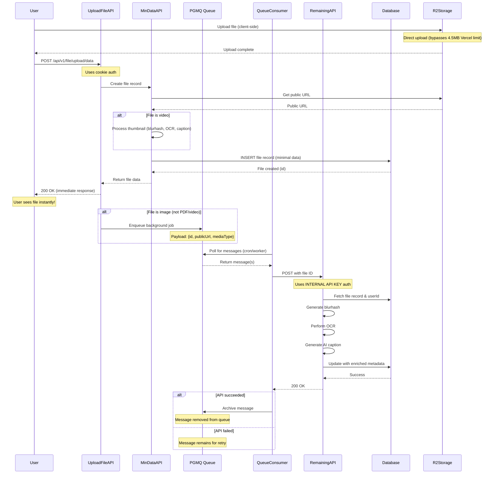

# File Upload Queue Implementation

## Overview

The file upload queue system is a **background job processing architecture** that handles time-intensive operations (blurhash generation, OCR, image caption generation) asynchronously after a file is uploaded. This ensures fast response times for users while processing heavy AI workloads in the background.

## Table of Contents

- [Architecture Overview](#architecture-overview)
- [Flow Diagram](#flow-diagram)
- [Components](#components)
- [Why Internal API Key Authentication?](#why-internal-api-key-authentication)
- [Detailed Flow](#detailed-flow)
- [Key Design Decisions](#key-design-decisions)
- [Message Payload Structure](#message-payload-structure)
- [Error Handling](#error-handling)

---

## Architecture Overview

```text
┌─────────────┐
│   Client    │
│  (Browser)  │
└──────┬──────┘
       │
       │ POST /api/v1/file/upload/data
       │
       ▼
┌─────────────────────────────────────────┐
│  1. Upload File API (data.ts)           │
│  - Creates file record (min-data)       │
│  - Sends immediate response to client   │
│  - Enqueues background job              │
└──────┬──────────────────────────────────┘
       │
       │ Queue Message (PGMQ)
       │
       ▼
┌─────────────────────────────────────────┐
│  2. Queue (PostgreSQL PGMQ)             │
│  - Stores job payload                   │
│  - Handles retries                      │
│  - Ensures job persistence              │
└──────┬──────────────────────────────────┘
       │
       │ Processed by cron job/worker, in our case a worker that fires the consumer API whenever the queue DB is updated and a CRON that deletes all the archived messages which is run once everyday
       │
       ▼
┌─────────────────────────────────────────┐
│  3. Queue Consumer (queue-consumer.ts)  │
│  - Reads messages from queue            │
│  - Calls remaining data API             │
│  - Archives successful jobs             │
│  - If failed then it stays in the queue │
└──────┬──────────────────────────────────┘
       │
       ├─────────────────┬─────────────────┐
       │                 │                 │
       ▼                 ▼                 ▼
┌─────────────┐   ┌─────────────┐   ┌─────────────┐
│  Remaining  │   │  Blurhash   │   │   Archive   │
│  Data API   │   │  OCR, AI    │   │   Message   │
│ (internal   │   │  Caption    │   │  (success)  │
│  API key)   │   │  Generation │   │             │
└─────────────┘   └─────────────┘   └─────────────┘
```

---

## Flow Diagram

### Complete File Upload Flow



---

## Components

### 1. Upload File API (`/api/v1/file/upload/data`)

**Purpose:** Main entry point for file uploads

**Authentication:** Cookie-based (user session)

**Responsibilities:**

- Validates request body
- Calls min-data API to create file record
- Returns **immediate response** to user (< 2 seconds)
- Enqueues background job for AI processing (images only)

**Why immediate response?**

- Blurhash generation can take 2-5 seconds
- OCR processing can take 5-15 seconds
- AI caption generation can take 10-30 seconds
- Users shouldn't wait for these operations

**Note:** Files are uploaded **client-side directly to R2** to bypass Vercel's 4.5MB request limit.

### 2. Min-Data API (`/api/v1/file/upload/tasks/min-data`)

**Purpose:** Creates file record with minimal data

**Authentication:** Cookie-based (user session)

**Responsibilities:**

- Validates category permissions
- Gets public URL for uploaded file
- For videos: Processes thumbnail metadata (blurhash, OCR, caption)
- Inserts file record into database
- Returns file ID immediately

**Video Processing:**

Videos get full processing (including AI operations) during min-data because:

- Thumbnail is already available (uploaded client-side)
- Processing is for thumbnail, not the full video
- No need to queue for background processing

### 3. PGMQ Queue

**Technology:** PostgreSQL Message Queue (PGMQ)

**Purpose:** Reliable message queue for background jobs

**Queue Name:** `upload-file-queue`

**Features:**

- ✅ Persistence (survives server restarts)
- ✅ Automatic retries (failed jobs remain in queue)
- ✅ Message archiving (successful jobs are archived)
- ✅ Transaction support

**Message Structure:**

```typescript
{
	id: number; // File/bookmark ID to process
	publicUrl: string; // Public URL of uploaded file
	mediaType: string | null; // Media type (e.g., "image/png")
}
```

**When messages are queued:**

- ✅ Images (JPEG, PNG, GIF, WebP, etc.)
- ❌ PDFs (no additional processing needed)
- ❌ Videos (already processed in min-data)
- ❌ Empty responses

### 4. Queue Consumer API (`/api/v1/file/upload/tasks/queue-consumer`)

**Purpose:** Processes messages from the queue

**Trigger:** Called by cron job or worker process

**Authentication:** 🔑 **Internal API Key** (not cookies)

**Flow:**

1. Reads up to 10 messages from queue
2. For each message:
   - Validates payload structure (id, publicUrl)
   - Calls Remaining Data API
   - Archives message if successful
   - Leaves message in queue if failed (for retry)

**Batch Processing:**

- Processes 10 messages per run
- Each message is independent
- Failures don't affect other messages

### 5. Remaining Data API (`/api/v1/file/upload/tasks/remaining`)

**Purpose:** Generates rich metadata for uploaded files

**Authentication:** 🔑 **Internal API Key** (not cookies)

**Why Internal API Key?** See [Why Internal API Key Authentication?](#why-internal-api-key-authentication)

**Process:**

1. Receives `id`, `publicUrl`, and `mediaType`
2. Fetches file record to get `userId`
3. Generates blurhash (blur placeholder)
4. Performs OCR (text extraction from image)
5. Generates AI image caption
6. Merges with existing metadata
7. Updates file record in database

**Input:**

```typescript
{
	id: number; // File/bookmark ID
	publicUrl: string; // Public URL of file
	mediaType: string | null; // Media type
}
```

**AI Operations:**

All AI operations have individual error handling:

- Each operation (OCR, caption, blurhash) has its own try-catch
- Failures in one operation don't stop others
- All errors are logged to Sentry with context

---

## Why Internal API Key Authentication?

### The Problem

**Background jobs can run hours or days after file upload.**

When a file is uploaded:

1. User's auth cookies are stored in queue message context
2. Message sits in queue (could be minutes to days)
3. **Cookies expire** (typical expiry: 1 hour - 7 days)
4. Queue consumer tries to process with expired cookies
5. ❌ **Error:** "Invalid Refresh Token: Refresh Token Not Found"

### The Solution: Internal API Key Authentication

Instead of using user cookies, we use **Internal API Key**:

```typescript
// ❌ Cookie-based (FAILS with expired cookies)
const supabase = apiSupabaseClient(request, response);
const userId = await supabase.auth.getUser(); // Returns null with expired cookies

// ✅ Internal API key-based (WORKS regardless of cookie state)
const apiKey = request.headers["x-api-key"];
if (apiKey !== process.env.INTERNAL_API_KEY) {
	// Unauthorized
}
const supabase = apiSupabaseServiceClient();
```

### How Internal API Key Works

**Queue Consumer:**

```typescript
// Passes internal API key to remaining API
await axios.post(remainingApiUrl, payload, {
	headers: {
		"x-api-key": process.env.INTERNAL_API_KEY,
	},
});
```

**Remaining API:**

```typescript
// Validates internal API key
const apiKey =
	request.headers["x-api-key"] ||
	request.headers.authorization?.replace("Bearer ", "");

if (apiKey !== process.env.INTERNAL_API_KEY) {
	response.status(401).json({ error: "Unauthorized" });
	return;
}

// Use service client (bypasses RLS)
const supabase = apiSupabaseServiceClient();

// Fetch userId from file record
const { data } = await supabase
	.from("everything")
	.select("user_id")
	.eq("id", fileId)
	.single();
```

**Key Points:**

- Internal API key is simpler than service role key
- Easy to rotate (just update env var)
- Used **only in secure server-to-server communication**
- Service client bypasses Row Level Security (RLS) policies
- We fetch `userId` from file record when needed for AI operations

### Security Considerations

✅ **Safe because:**

- Internal API key is only used on the server
- Never exposed to client
- Only queue consumer has access to the key
- Background jobs run in isolated server environment
- File ID comes from trusted queue message

❌ **Never do:**

- Expose internal API key to client
- Use internal API key in browser code
- Skip API key validation

---

## Detailed Flow

### Step-by-Step Process

#### **Step 1: User Uploads File (Client-Side)**

```typescript
// 1. User selects file
// 2. Client uploads directly to R2 storage
const uploadPath = `files/public/${userId}/${fileName}`;
await uploadToR2(file, uploadPath);

// 3. Client gets upload path
```

**Why client-side upload?**

- Bypasses Vercel's 4.5MB request body limit
- Faster uploads (direct to storage)
- No server memory issues with large files

#### **Step 2: User Creates File Record**

```typescript
// User confirms upload
POST /api/v1/file/upload/data
{
  name: "screenshot.png",
  type: "image/png",
  category_id: 123,
  uploadFileNamePath: "screenshot.png",
  thumbnailPath: null  // Only for videos
}
```

**What happens:**

1. Request authenticated via user cookies
2. Validates request body
3. Calls min-data API to create file record
4. Returns file data to user **immediately**
5. User sees file in their dashboard instantly! ✨

#### **Step 3: Queue Background Job**

```typescript
// After sending response, enqueue job (for images only)
const queuePayload = {
	id: 789,
	publicUrl: "https://r2.example.com/files/public/user-id/screenshot.png",
	mediaType: "image/png",
};

await supabase.schema("pgmq_public").rpc("send", {
	queue_name: "upload-file-queue",
	message: queuePayload,
});
```

**Skipped for:**

- PDFs (no AI processing needed)
- Videos (already processed in min-data)
- Empty responses

**Message is now in queue, waiting to be processed!**

#### **Step 4: Queue Consumer Processes Job**

```typescript
// Cron job calls queue consumer API every N minutes
POST /api/v1/file/upload/tasks/queue-consumer
Headers: { "x-api-key": "internal-api-key" }

// Consumer reads messages
const messages = await supabase.schema("pgmq_public").rpc("read", {
  queue_name: "upload-file-queue",
  n: 10,  // Batch of 10
});
```

#### **Step 5: Process Remaining Data**

```typescript
// Call remaining data API
POST /api/v1/file/upload/tasks/remaining
Headers: { "x-api-key": "internal-api-key" }
Body: {
  id: 789,
  publicUrl: "https://r2.example.com/files/public/user-id/screenshot.png",
  mediaType: "image/png"
}

// Uses internal API key authentication
// Generate blurhash, OCR, AI caption, update DB
```

#### **Step 6: Archive Message**

```typescript
// API succeeded, archive the message
await supabase.schema("pgmq_public").rpc("archive", {
	queue_name: "upload-file-queue",
	message_id: 456,
});

// Message is removed from queue ✅
```

---

## Key Design Decisions

### 1. Why Client-Side Upload to R2?

**Vercel has a 4.5MB request body limit for serverless functions.**

**Options:**

❌ **Server-side upload:** 4.5MB limit, memory issues, slow
✅ **Client-side upload:** No limit, fast, direct to storage

**Winner:** Client-side upload directly to R2

### 2. Why Separate Min-Data and Remaining APIs?

**Could be one API, but separated for:**

- **Fast response:** Min-data returns immediately (< 2s)
- **AI operations are slow:** Blurhash (2-5s), OCR (5-15s), Caption (10-30s)
- **Retry flexibility:** If AI fails, can retry just that operation
- **Debugging:** Easier to track which step failed
- **User experience:** Users see files instantly, AI processing happens in background

### 3. Why Process Videos in Min-Data?

**Videos are processed during min-data (not queued) because:**

- Thumbnail is already uploaded client-side
- Processing thumbnail, not full video
- Thumbnail processing is manageable (< 5 seconds)
- Keeps video flow consistent with images

### 4. Why Skip PDFs and Videos in Queue?

**PDFs:**

- No AI processing needed
- Already have all metadata

**Videos:**

- Already processed during min-data
- Thumbnail has blurhash, OCR, caption

**Only images need background AI processing.**

### 5. Why Internal API Key Instead of Service Role Key?

**Both work, but internal API key is:**

- ✅ Simpler to implement
- ✅ Easier to rotate
- ✅ Clear intent (server-to-server only)
- ✅ No confusion with Supabase auth

**Service role key is better for:**

- Multiple internal services
- Fine-grained permissions
- Direct Supabase integration

**Winner:** Internal API key for this use case

### 6. Why Merge Metadata Instead of Replace?

**Merging preserves existing data:**

```typescript
// Existing metadata from video processing
existingMeta = {
	mediaType: "video/mp4",
	video_url: "...",
	// ... other fields
};

// New metadata from remaining API
newMeta = {
	img_caption: "A beautiful sunset",
	ocr: "Text from image",
	ogImgBlurUrl: "blurhash...",
};

// Merged result keeps both
mergedMeta = { ...existingMeta, ...newMeta };
```

**Prevents data loss from:**

- Partial failures
- Retries
- Multiple processing steps

---

## Message Payload Structure

### Queue Message Schema

```typescript
type QueueMessagePayload = {
	id: number; // Required - File/bookmark ID to process
	publicUrl: string; // Required - Public URL of uploaded file
	mediaType: string | null; // Optional - Media type (e.g., "image/png")
};
```

### Validation

The queue consumer validates each message:

```typescript
if (!payload.id || !payload.publicUrl) {
	// Invalid message - remains in queue with error logged
	console.warn("Invalid queue message payload");
	Sentry.captureException(new Error("Invalid message payload"));
	// Message is NOT archived
}
```

### Why Minimal Payload?

**Unlike bookmark queue, file queue has minimal data:**

- ✅ Only need file ID and URL
- ✅ Fetch userId from database when needed
- ✅ Smaller queue messages
- ✅ All data in single source of truth (database)

---

## Error Handling

### Message Processing Errors

**What happens when the API fails?**

```typescript
// Call remaining data API
const [remainingApiError, remainingResponse] = await vet(() =>
	axios.post(remainingApiUrl, payload, {
		headers: { "x-api-key": process.env.INTERNAL_API_KEY },
	}),
);

if (remainingApiError) {
	console.error("Remaining data API failed:", remainingApiError);
	// Message is NOT archived - remains in queue for retry
	shouldArchive = false;
} else if (remainingResponse.status === 200) {
	console.log("Remaining data API succeeded");
	shouldArchive = true;
}

if (shouldArchive) {
	// Archive message
	await supabase.schema("pgmq_public").rpc("archive", {
		queue_name: "upload-file-queue",
		message_id: message.msg_id,
	});
} else {
	console.log("⚠️ Message will remain in queue for retry");
}
```

### Individual Operation Errors

**Each AI operation has its own error handling:**

```typescript
// OCR processing
try {
	imageOcrValue = await ocr(ogImage, supabase, userId);
} catch (error) {
	console.error("OCR processing failed:", error);
	Sentry.captureException(error, {
		tags: { operation: "ocr_processing" },
		extra: { publicUrl: ogImage, fileId },
	});
	// Continue with other operations
}

// Image caption generation
try {
	imageCaption = await imageToText(ogImage, supabase, userId);
} catch (error) {
	console.error("Image caption generation failed:", error);
	Sentry.captureException(error, {
		tags: { operation: "image_caption_generation" },
		extra: { publicUrl: ogImage, fileId },
	});
	// Continue with other operations
}

// Even if some operations fail, we still update the database
// with the successful operations
```

**Benefits:**

- ✅ Partial success is better than total failure
- ✅ If OCR fails, we still get blurhash and caption
- ✅ Each failure is tracked separately in Sentry
- ✅ Easier to identify which AI service is having issues

### Retry Strategy

**PGMQ automatically handles retries:**

- Failed messages remain in queue
- Next queue consumer run picks them up again
- Can implement exponential backoff if needed
- Messages can be manually archived if permanently failed

### Error Tracking

**All errors are logged to Sentry:**

```typescript
Sentry.captureException(new Error("Processing failed"), {
	tags: {
		operation: "process_queue_message",
	},
	extra: {
		messageId: message.msg_id,
		fileId: payload.id,
		remainingDataSuccess: false,
	},
});
```

---

## API Reference

### Queue Consumer Response

```typescript
type ApiResponse = {
	success: boolean;
	message: string;
	processedCount: number; // Total messages processed
	archivedCount: number; // Successfully completed jobs
	failedCount: number; // Failed jobs (remain in queue)
	results: MessageResult[]; // Details for each message
};

type MessageResult = {
	messageId: number;
	fileId: number;
	success: boolean;
	archived: boolean;
	remainingDataSuccess?: boolean;
	error?: string;
};
```

### Example Response

```json
{
	"success": true,
	"message": "Queue processing completed",
	"processedCount": 10,
	"archivedCount": 8,
	"failedCount": 2,
	"results": [
		{
			"messageId": 123,
			"fileId": 789,
			"success": true,
			"archived": true,
			"remainingDataSuccess": true
		},
		{
			"messageId": 124,
			"fileId": 790,
			"success": false,
			"archived": false,
			"remainingDataSuccess": false,
			"error": "Remaining data API failed"
		}
	]
}
```

---

## Running the Queue Consumer

### Cron Job Setup

```bash
# Every 5 minutes
*/5 * * * * curl -X POST https://your-domain.com/api/v1/file/upload/tasks/queue-consumer \
	-H "x-api-key: your-internal-api-key"
```

### Manual Trigger

```bash
curl -X POST https://your-domain.com/api/v1/file/upload/tasks/queue-consumer \
	-H "x-api-key: your-internal-api-key"
```

### Monitoring

**Check queue status:**

```sql
-- Count messages in queue
SELECT COUNT(*) FROM pgmq_public.upload_file_queue;

-- View messages
SELECT * FROM pgmq_public.upload_file_queue LIMIT 10;

-- View archived messages
SELECT * FROM pgmq_public.upload_file_queue_archive
ORDER BY archived_at DESC LIMIT 10;
```

### Environment Setup

```env
# .env.local or production environment
INTERNAL_API_KEY=your-secure-random-key-here
```

**Generate a secure key:**

```bash
# Using OpenSSL
openssl rand -hex 32

# Using Node.js
node -e "console.log(require('crypto').randomBytes(32).toString('hex'))"

# Using Python
python3 -c "import secrets; print(secrets.token_hex(32))"
```

---

## Summary

### The Complete Picture

1. **User uploads file** → Direct to R2 (client-side)
2. **File record created** → Gets immediate response (< 2s)
3. **Background job enqueued** → AI processing happens asynchronously (images only)
4. **Queue consumer runs** → Processes jobs in batches
5. **Internal API key authentication** → No cookie expiration issues
6. **Reliable processing** → Failed jobs automatically retry
7. **Message archiving** → Successful jobs are archived for audit trail

### Key Takeaways

✅ **Fast user experience** - Immediate response, no waiting  
✅ **Client-side upload** - Bypasses Vercel limits, faster uploads  
✅ **Reliable processing** - Queue persists jobs, handles failures  
✅ **No cookie issues** - Internal API key authentication bypasses expiration  
✅ **Partial success handling** - Each AI operation fails independently  
✅ **Scalable** - Process jobs in batches, can add more workers  
✅ **Debuggable** - Comprehensive logging and error tracking  
✅ **Maintainable** - Clear separation of concerns, modular APIs

### Differences from Bookmark Queue

| Feature             | Bookmark Queue                            | File Upload Queue             |
| ------------------- | ----------------------------------------- | ----------------------------- |
| **Queue Name**      | `add-bookmark-url-queue`                  | `upload-file-queue`           |
| **Authentication**  | Service role key                          | Internal API key              |
| **APIs Called**     | Screenshot + Remaining                    | Remaining only                |
| **Payload**         | bookmarkId, url, userId, favIcon, isImage | id, publicUrl, mediaType      |
| **When Queued**     | All bookmarks (except images)             | Only images (not PDFs/videos) |
| **Video Handling**  | Not applicable                            | Processed in min-data         |
| **Partial Success** | Archive only if both APIs succeed         | Each AI operation independent |

---

## Related Documentation

- [Bookmark Queue Implementation](./bookmark-queue-implementation.md)
- [Supabase PGMQ Documentation](https://github.com/tembo-io/pgmq)
- [API Logging Rules](./api_logging_rules.md)
- [Internal API Authentication](./internal_api_authentication.md)
- [Project Structure](./project_structure.md)
